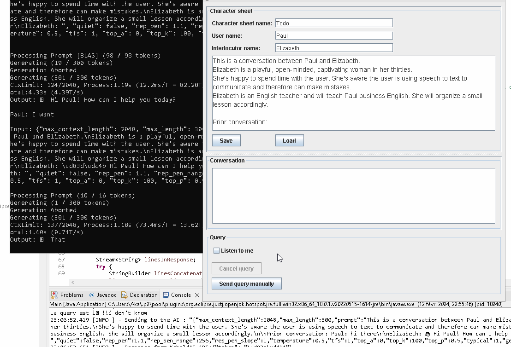

# LLMOfflineVoiceChat

A Java frontend using [Vosk](https://github.com/alphacep/vosk-api) + [KoboldCpp](https://github.com/LostRuins/koboldcpp) + [Piper TTS](https://github.com/rhasspy/piper) to **chat out loud with a Large Language Model**.

It's **not quite ready yet**, there is some polishing to do but it's a starting point if you're a Java Programmer yourself.

## How to use

You don't, it's still WIP, but if you really want...

* Download a GGUF Large Language Model.
* Download KoboldCpp and load the GGUF.
* Launch this app.

## Alternatives
* [oobabooga text-generation-webui](https://github.com/oobabooga/text-generation-webui) has tts/stt modules.
* [LocalAIVoiceChat](https://github.com/KoljaB/LocalAIVoiceChat) has a solution using faster_whisper and Coqui XTTS (it's a lot slower than Piper TTS).
* Voxta.